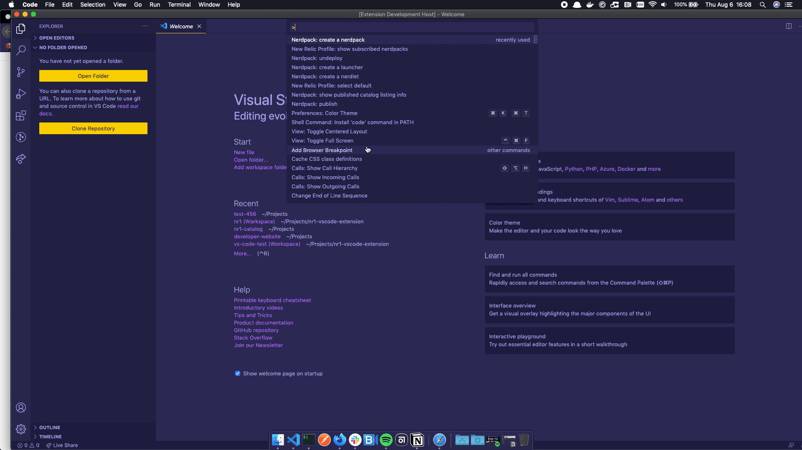

# NR1? New Relic Programmability? New Relic Apps? (What do we want to name this extension?)

Build and deploy nerdpacks directly from Visual Studio Code

Table of Contents?

## Requirements (or Important?)

Need to install NR1 CLI
Profile (API Key) is required to create a Nerdpack
Note: Nerdpack will be created under the account associated with the current default profile

## Getting Started

1. Install the extension from the [Visual Studio Code Marketplace](https://marketplace.visualstudio.com) (or through your VSCode app).
2. Access the VSCode command palette _(Ctrl+Shift+P in Windows/Linux or Cmd+Shift+P in macOS)_.
3. Enter "Nerdpack" or "New Relic" to get a list of the available commands.
4. Select a command to execute.

## Features

These are the features currently supported by this extension.

### CLI Commands

| Name                                | Description                                                                                                                                                                               |
| ----------------------------------- | ----------------------------------------------------------------------------------------------------------------------------------------------------------------------------------------- |
| `New Relic Profile: select default` | Chooses which profile should be default. [ℹ️](https://developer.newrelic.com/explore-docs/nr1-common#nr1-profiles)                                                                        |
| `Nerdpack: generate uuid`           | Assigns a new UUID to your Nerdpack. [ℹ️](https://developer.newrelic.com/explore-docs/nr1-nerdpack#nr1-nerdpackuuid)                                                                      |
| `Nerdpack: create a nerdpack`       | Creates a new component from a Nerdpack template. [ℹ️](https://developer.newrelic.com/explore-docs/nr1-common#nr1-create)                                                                 |
| `Nerdpack: create a nerdlet`        | Creates a new component from a Nerdlet template. [ℹ️](https://developer.newrelic.com/explore-docs/nr1-common#nr1-create)                                                                  |
| `Nerdpack: create a launcher`       | Creates a new component from a Launcher template. [ℹ️](https://developer.newrelic.com/explore-docs/nr1-common#nr1-create)                                                                 |
| `Nerdpack: run local development`   | Launches a server with your Nerdpack locally on the New Relic One platform, where it can be tested live. [ℹ️](https://developer.newrelic.com/explore-docs/nr1-nerdpack#nr1-nerdpackserve) |

### Snippets

## Known Issues

No current known issues. Report any issues you find here: [https://github.com/newrelic/nr1-vscode-extension/issues](https://github.com/newrelic/nr1-vscode-extension/issues)
